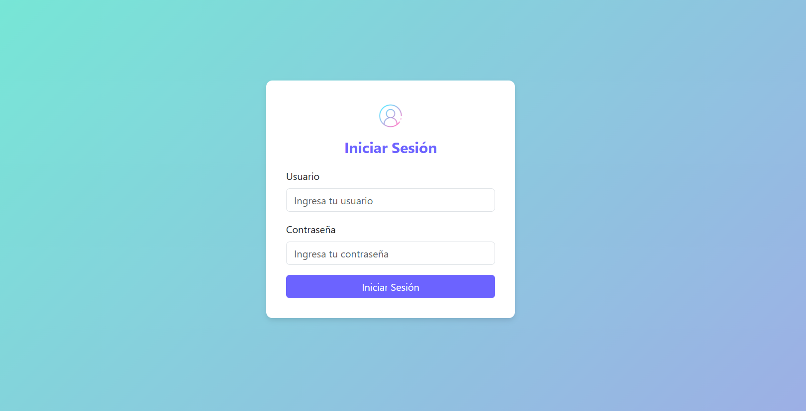
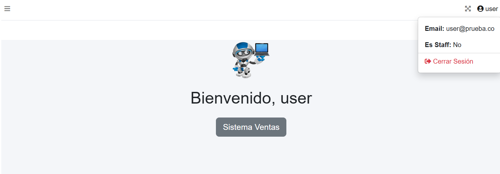
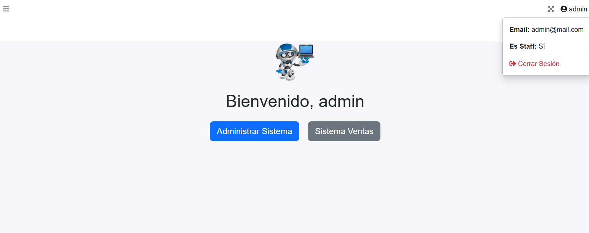
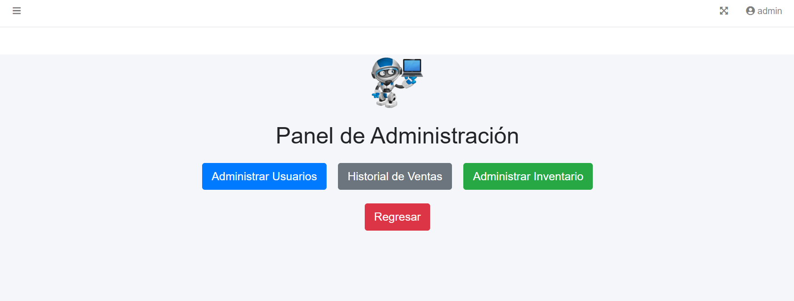
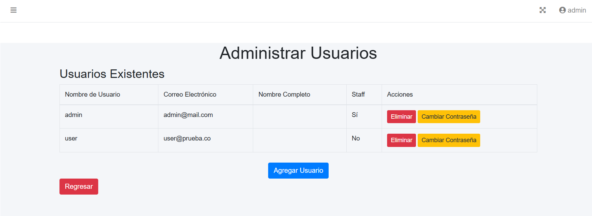
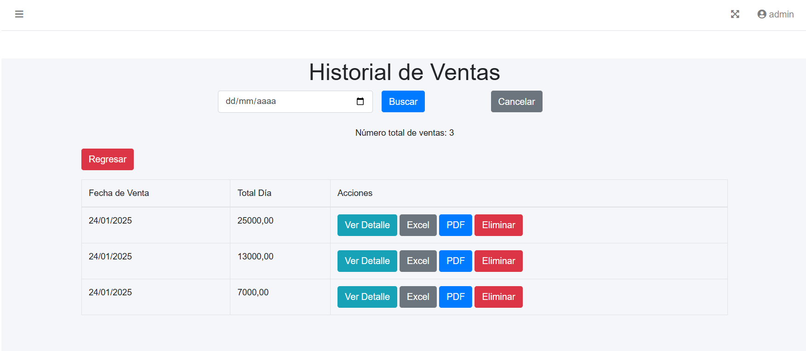
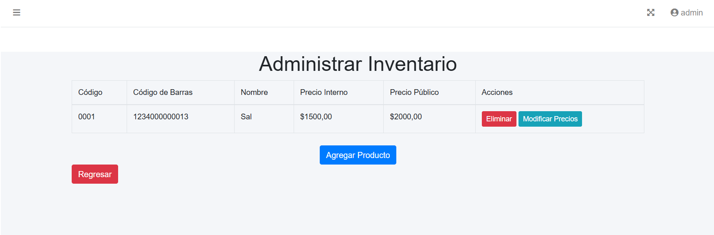

# Sistema de Ventas - Django

Este proyecto es un **sistema de ventas** desarrollado con Django, que incluye funcionalidades para usuarios y administradores, con gestión de inventario, ventas y administración de usuarios.

---

## Requisitos

Antes de ejecutar el proyecto, asegúrate de tener instalado:

- Python
- Django

## Instalación de dependencias

- pip install django-widget-tweaks
- pip install openpyxl

## Ejecutando

- python manage.py runserver

## Capturas de Pantalla

### Interfaz de Usuario

### Interfaz de Administrador

